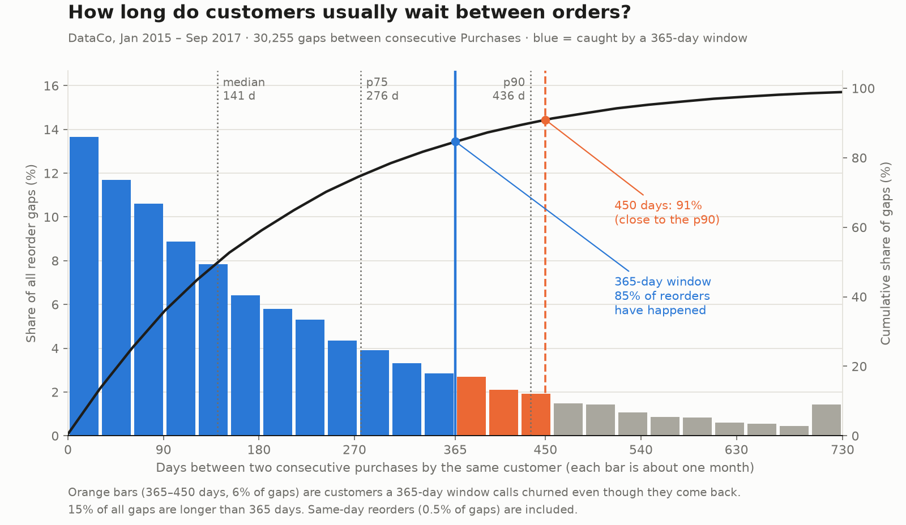

# Map: DataCo customer churn

Charted 2026-10-07 on branch `feat/supply-chain-2`. Vocabulary: [`dataco-churn/CONTEXT.md`](../../dataco-churn/CONTEXT.md). Terms in capitals-first form below (Purchase, Cutoff, Churned, ...) are defined there.

## Destination

A `ready-for-agent` spec at `.scratch/dataco-churn/spec.md` for a DataCo customer-churn project, with every open decision below settled. The spec describes two pieces: a **method notebook** rendered to a site page, then a **Shiny risk dashboard** reading precomputed scores. This map plans the decisions only. It builds nothing.

## Notes

**Dataset:** DataCo Smart Supply Chain (Kaggle `shashwatwork/dataco-smart-supply-chain-for-big-data-analysis`, CC0). 180,519 Order lines, 65,752 Orders, 20,652 Customers, synthetic. Local copy is not in the repo yet; `data/` stays gitignored.

**Settled while charting** (these are not tickets; they are the ground the tickets stand on):

| Decision | Settled as |
|---|---|
| Scope | DataCo only. Walmart has no customers and is a separate effort |
| NLP / Laya | Out. DataCo has no customer text (`Product Description` is 100% null) |
| Destination | A spec marked `ready-for-agent` |
| Data window | Observation window only, 1 Jan 2015 – 30 Sep 2017 (12,330 Customers). The Late-arrival block is documented and never modeled |
| Purchase | Any Order except `CANCELED`, `SUSPECTED_FRAUD`, `PENDING_PAYMENT` (42,285 of 57,349 Orders; 12,030 Customers keep at least one) |
| Churned | No Purchase in the 365 days after the Cutoff. 450 days is a sensitivity inside the survival track |
| Cutoff design | One Cutoff, 2016-09-30, customers split 71/14/14 stratified by Churned with a sealed test. A temporal drift check (train 2015-09-30, test 2016-09-30) is a separate ticket |
| Who is predicted | Every Active customer (11,000 at 2016-09-30). Profit at risk reported beside PR-AUC |
| Models | Rule baseline → logistic regression → gradient boosting, plus a Kaplan-Meier / Cox survival track |
| Ships | Notebook page first, Shiny dashboard second |
| Null result | Accepted. A first late Order changes the repeat rate by almost nothing (57.2% vs 56.8%), and `Late_delivery_risk` is a formula of two columns (97.6% match) |

**Evidence behind the 365-day window** (30,255 Reorder gaps in the Observation window):



```
Reorder gap          share   cumulative
  0 – 30 days        13.2%      13.2%     median 141 d
 30 – 90             21.9%      35.1%     p75    276 d
 90 – 180            23.1%      58.2%     p90    436 d
180 – 270            15.5%      73.7%
270 – 365            10.5%      84.2%     ≤ 365 d: 84.7%   (15.3% of gaps are longer)
365 – 450             6.2%      90.4%     ≤ 450 d: 90.9%
450 – 540             4.2%      94.6%
540 – 730             3.8%      98.4%
```

The band table omits same-day reorders (0.5% of gaps), so its cumulative column reads about 0.4 points low; the exact figures are the two marked "≤" and the chart.

```
Label window (days)   churn rate at Cutoff 2016-06-30   latest valid Cutoff
   90                       73.6%                         2017-07-02
  180                       53.9%                         2017-04-03
  270                       39.8%                         2017-01-03
  365                       28.9%  (3,027 of 10,480)      2016-09-30
  450                       21.6%                         2016-07-07
```

At 365 days, 761 of the 3,027 Churned customers (25%) come back within the next 85 days. That is the cost of the choice, and why 450 days is kept as a sensitivity.

**Traps every ticket must respect:**
- `Order Profit Per Order` is per Order line. Sum it over the lines.
- Order status is not a lifecycle: the mix is the same in every year (2015 Orders are still 22% `PENDING_PAYMENT`).
- Customer email and password are masked (one unique value each). Names and street are personal data and stay out.
- Churn at six Cutoffs between 2015-06-30 and 2016-09-30 stays within 28.4–29.9%, so the base rate is stable.

## Decisions so far

<!-- one line per closed ticket: [title](link): gist -->

None yet. Eight tickets are open (see `issues/`).

## Not yet specified

- **Explaining the boosting model.** Whether and how to show which behaviours drive risk (global drivers, per-customer reasons). Wait for the feature set and the evaluation protocol.
- **Wiring into the site.** Page paths, the header entry, the deploy-workflow staging steps and the analytics tag. Wait for the dashboard views.
- **Data handling and write-up.** Where the raw CSV lives, how to fetch it, and the one-paragraph note on the Late-arrival block. Wait for the final shape of the notebook.

## Out of scope

- **Walmart.** No customers; it would need a different entity (department lines). Separate effort.
- **Laya / NLP.** No customer text in DataCo. The Telco, Yelp and complaint-text projects carry that angle.
- **Customer lifetime value (BG/NBD).** Not chosen. Profit at risk uses trailing profit instead.
- **Retention uplift.** There is no experiment data, so the project never claims that a retention action saves a customer.
- **Modeling the Late-arrival block.** One Order per Customer, no returns, no signal.
- **Real-time scoring and MLOps.**
